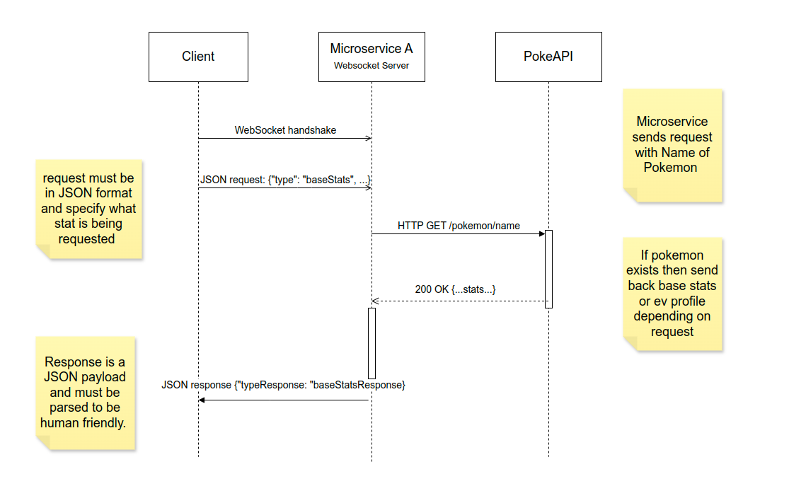

# Microservice A -- Pokemon WebSocket Server API

A simple WebSocket microservice that provides:

- **baseStats**: real Pokemon base stats (HP, Attack, Defense, Special Attack, Special Defense, Speed) from PokeAPI
- **holdItems**: dummy data item recommendations for a given battle type
- **evProfile**: real EV (effort value) profiles from PokeAPI

---


## Service URL
#### Hosted with Render at:
>
> **wss://pokemon-stats-k0jo.onrender.com**
>


## How to REQUEST Data

Open a WebSocket to the service URL and send a single JSON payload. You must supply the following:


### Example: Requesting base stats

| Field       | Type     | Description                                                             |
|-------------|----------|-------------------------------------------------------------------------|
| `type`      | String   | `"baseStats"`                                                           |
| `requestId` | Number   | Your unique ID for matching response to request                         |
| `name`      | String   | The Pokémon’s name (e.g. `"Charizard"`)                                 |

#### Request JSON Payload:
>```json
> {"type":"baseStats","requestId":227,"name":"Charizard"}
>```
#### Request Sample Code: 
> ```js
> const ws = new WebSocket('wss://pokemon-stats-k0jo.onrender.com');
> ws.onopen = () => {
>   ws.send(JSON.stringify({
>     type:         'baseStats',
>     requestId:    227,
>     name:         'Charizard'
>   }));
> };


### Example: Requesting EV Profile stats

| Field       | Type     | Description                                                             |
|-------------|----------|-------------------------------------------------------------------------|
| `type`      | String   | `"evProfile"`                                                           |
| `requestId` | Number   | Your unique ID for matching response to request                         |
| `name`      | String   | The Pokémon’s name (e.g. `"Bulbasaur"`)                                 |
| `trainer`   | String   | **Required** if `type === "evProfile"` (e.g. `"Ash"`)                   |

#### Request JSON Payload:
>``` json
> {"type":"evProfile","requestId":228,"name":"Bulbasaur","trainer":"Ash"}
>```
#### Request Sample Code: 
>```js
> const ws = new WebSocket('wss://pokemon-stats-k0jo.onrender.com');
> ws.onopen = () => {
>   ws.send(JSON.stringify({
>     type:         'evProfile',
>     requestId:    228,
>     name:         'Bulbasaur'
>     trainer:      'Ash'
>   }));
> };
> ```


---


### Example: Requesting Hold Items

| Field       | Type     | Description                                                             |
|-------------|----------|-------------------------------------------------------------------------|
| `type`      | String   | `"evProfile"`                                                           |
| `requestId` | Number   | Your unique ID for matching response to request                         |
| `name`      | String   | The Pokémon’s name (e.g. `"Gengar"`)                                    |
| `battleType`| String   | **Required** if `type === "holdItems"` (e.g. `"defensive"`)             |

#### Request JSON Payload:
> ```json 
> {"type":"holdItems","requestId":229,"name":"Gengar","battleType":"defensive"}
>```

#### Request Sample Code:
> ```js
> const ws = new WebSocket('wss://pokemon-stats-k0jo.onrender.com');
> ws.onopen = () => {
>   ws.send(JSON.stringify({
>     type:         'evProfile',
>     requestId:    229
>     name:         'Gengar'
>     battleType:   'defensive'
>   }));
> };
> ```


---


## How to RECEIVE Data

After you send the request, the microservice will reply with exactly **one** JSON payload.
Here are the three possible responses:

### Base Stats Response Example
>```json
> {"type":"baseStatsResponse","requestId":1,"name":"Charizard","data":{"hp":78,"attack":84,"defense":78, "special_attack":109,"special_defense":85,"speed":100}}
> ```

### Hold Item Response Example 
>```json
> {"type":"holdItemsResponse","requestId":2,"name":"Gengar","data":[{"item":"Leftovers","justification":"Provides  passive healing each turn"},{"item":"Choice Scarf","justification":"Boosts speed but locks move"}]}
> ```

### EV Profile Response Example
>```json
> {"type":"evProfileResponse","requestId":3,"name":"Bulbasaur","data":{"hp":1,"attack":0,"defense":0,"special_attack":0,"special_defense":0,"speed":1}}
> ```

### Example: JavaScript
> ```js
> ws.on('message', rawData => {
>  const resp = JSON.parse(rawData);
>  // resp.type       === 'baseStatsResponse' | 'holdItemsResponse' | 'evProfileResponse'
>  // resp.requestId  === the same ID you sent
>  // resp.name       === the Pokémon name
>  // resp.data       === the stats, stub data, or EV profile
>});
> ```

## Troubleshooting

Before reaching out, please run through these steps:

1. **WebSocket availability**  
   `wscat -c wss://pokemon-stats-k0jo.onrender.com`

2. **Test client**  
   - `node test.js baseStats Charizard`  
   - `node test.js holdItems Gengar offensive`  
   - `node test.js evProfile Bulbasaur Ash`  
   _(You should see both `OUT…` and `IN…`.)_

3. **Local run**  
   ```bash
   git clone https://github.com/troms-112/3PugsRoastery.git
   cd 3PugsRoastery/microserviceA
   npm install && npm start
   node test.js baseStats Pikachu


## UML Sequence Diagram


